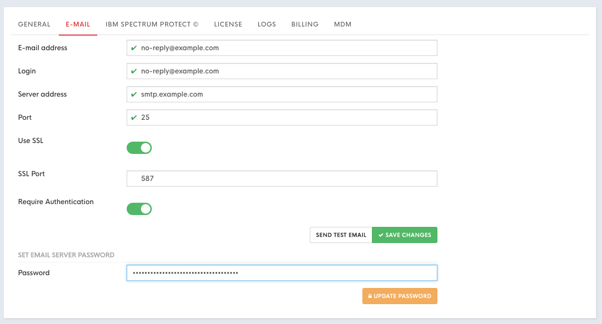

# Configuring instance

## General settings

## Configuring e-mail settings

This e-mail configuration will be used to communicate with user and send reports. 

1. Click **Settings** located in top bar, this will move you to KODO configuration page
2. Click **General** tab.
3. Provide the necessary information for the e-mail server configuration
   * **E-mail address** – address used to sending e-mails from KODO
   * **Login** – username used to login to e-mail server \(optional\)
   * **Server address** - IP or DNS name of the e-mail server
   * **Port** - port of the e-mail server
   * **Use SSL** - set to "on" if SSL communication is required
   * **Require Authentication** - set to “on” if server requires authentication

     ​​
4. Click **SAVE CHANGES** button.
5. Provide password for e-mail server in **SET EMAIL SERVER PASSWORD** section
6. click “UPDATE PASSWORD” button


You can test your configuration click **SEND TEST EMAIL** button


## Configuring Spectrum Protect\(TSM\) connection


If you are using KODO Virtual Appliance Bundle change you need to change "Server address" configuration. "Server address" should point to KODO server IP address that will be available for backup clients! For Virtual Appliance no further changes in this section are required.


To set up connection with backup server:

1. Click **Settings** located in top bar, this will move you to KODO configuration page
2. Click **Spectrum Protect** tab.
3. Provide all necessary Spectrum Protect server settings:
   * **Server address** – IP/DNS name of Spectrum Protect Server
   * **Port** – Spectrum Protect client port
   * **Adminitrative port** – Spectrum Protect Administrative port \(if different from client port\)
   * **Nodename** – nodname used by KODO \(created in previous steps\)
4. Click **SAVE CHANGES** button.
5. Provide password for node in “SET IBM SP PASSWORD” section
6. Click **UPDATE PASSWORD** button

## License registration

After installation or Virtual Appliance deployment KODO Server is running in TRIAL mode for 30 days. After that time you will need to provide valid license key.

To get a license key please contact with our local [partner](https://storware.eu/en/partners/) or [Storware](mailto:info@storware.eu) team.

If you already have a valid license key please follow the steps:

1. Click **Settings** located in top bar, this will move you to KODO configuration page
2. Click **License** tab.
3. Provide your license key in **Update your Kodo license key** field
4. Click **UPDATE LICENSE** button

